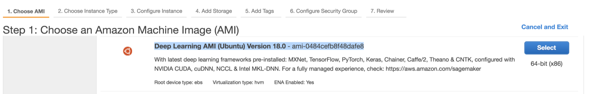
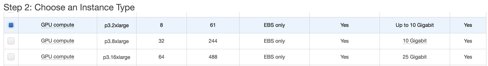
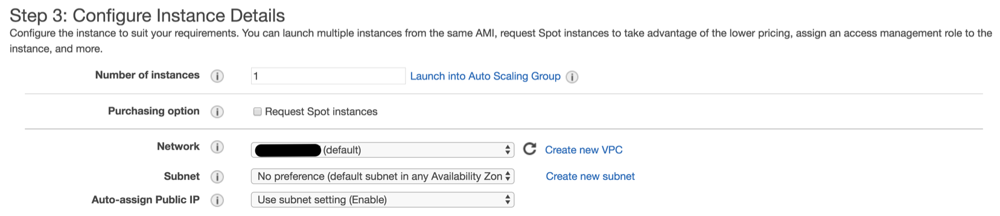
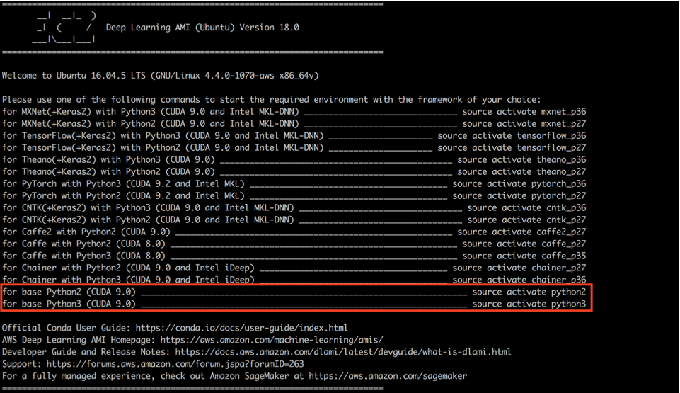
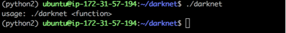
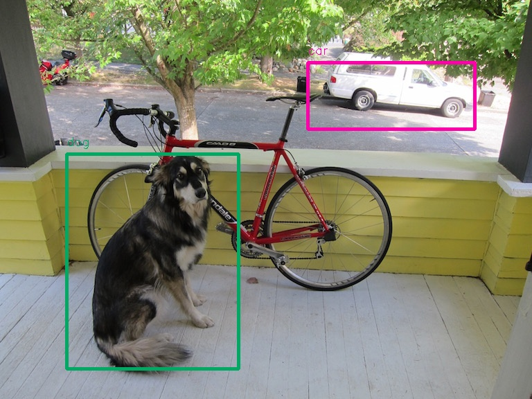
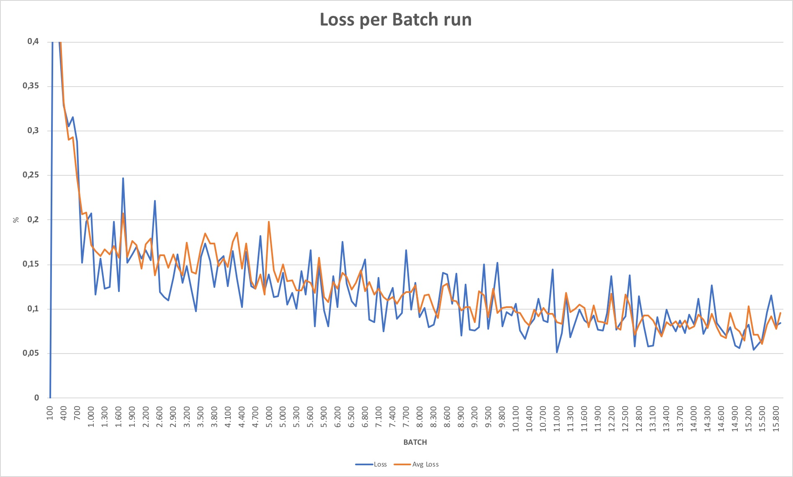
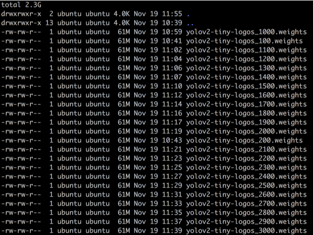

# Tiny Yolo V2 ported to run on Edge Devices powered by Movidius, running on AWS 
Custom training Object Detection on Tiny-YoloV2 on AWS and then transfering the model to Movidius to perform accelerated inference on  edge devices

## Introduction

When you have Deep Learning models running on edge devices sending all the data to cloud services once these devices are not powerful enough to do the whole processing. Intel has created a small device called <a href="https://www.movidius.com/"> Movidius </a> that can act as an accelerator for edge devices like a Raspberry Pi.

Of course there are several limitations regarding the size of the model and specifically the supported operations, layers and networks that it can run. The <a href="https://movidius.github.io/ncsdk/release_notes.html"> Movidius SDK Release Notes </a> denotes some of these limitations.  

One network that I found to be really handy for object detection and that can be converted to run on a Raspberry Pi with Movidus is <a href="https://pjreddie.com/darknet/yolo/"> Tiny Yolo v2 </a> once it is fast to train, transfer learning does not create additional layers and it can pass thru the <a href="https://github.com/thtrieu/darkflow"> Darkflow  </a> transformations required to go from Yolo to Tensorflow and then to Movidius format. 

## Requirements

For this project there will be two environments: Training and Edge Ddevice

### Training Environment 
For this environment we will be using a server with an Nvidia GPU for training. 
I would recommend an AWS EC2 p3.2xlarge instance that contains a single V100 GPU making it simpler to train than multiple GPUs and still affordable enough for this project (as of writing around $3/hour). 

* AWS EC2 p3.2xlarge instance 
* AWS Deep Learning AMI (Deep Learning AMI (Ubuntu) Version 18.0 - ami-0484cefb8f48dafe8) 
* [Darknet](https://pjreddie.com/darknet/)
* [Yolo (You Only Look Once)](https://pjreddie.com/darknet/yolov2/)Object Detection 
* [Darkflow](https://github.com/thtrieu/darkflow) to help transform Yolo model into Tensorflow

### Edge Device 
The idea behind this project is to allow for low cost devicdes to perform near real time inference. ALthough it would be possible to run the models entirely on low power CPU, if we need something near real time we will need to boost its processing capacity with an accelerator. 

* Raspberry Pi 3B+ 
* 16GB card 
* Raspbian 
* USB Webcam 
* [Movidius USB Stick](https://www.movidius.com/) for accelerated

## Setting things up for Training

### Preparing the Training Instance 

In this section we will install and prepare the EC2 instance to run our training jobs. We will not go thru every step of the instance creation, assuming you already have an AWS account and knows how to deploy and properly configure an instance for SSH access. 

We have provided a [Cloudformation script](create_training_instance_us-east-1.yaml) to create the instance but if you want do customized it or deploy in another region than US-EAST-1, the main steps you have to watch for while creating the server are described below: 

We will use the *Deep Learning AMI (Ubuntu) Version 18.0 - ami-0484cefb8f48dafe8* to create our instance (there can be a new version of the AMI when you deploy your instance once they get updated quite frequently, but it shouldn't be an issue for the project in case you decide to use a newwer one):


In order to choose an instance with GPU support, choose p3.2xlarge as the instance type (as the time of writing this instance will cost you around $3 per active hour plus the storage space):


Also, if you need to access it thru SSH externally you can assign a Public IP to it


Accepting the other defaults should be alright for the project. 

Thanks to the AMI, the Instance comes up preinstalled with many Deep Learning tools already set up, as well as some prerequisites like CUDA and Python Libraries, making our life way much easier. 


SSH the newly created instance and activate the *python2* environment with `source activate python2`

### Installing Darknet

Let's move to the next step, installing the required software to training the models. You can follow the guide directly from [Darknet Fork from AlexeyAB](https://github.com/AlexeyAB/) or cut directly to the steps here: 
````bash
git clone https://github.com/AlexeyAB/darknet.git
cd darknet
````
In order to have CUDA enabled we need to change the ````Makefile```` changing the following parameters from 0 to 1 
````
GPU=1
CUDNN=1
CUDNN_HALF=1
OPENCV=0
AVX=0
OPENMP=1
````
Then compile it runing ````make````.  

If everything goes fine, you have an executable in your working dir. Let's test it ! 
  
The message shows it has compiled correctly. 

### Testing Darknet with Tiny YOLO v2

In order to run our test, we need to download a pre-trained weights file. There are several files available. We will be using Tiny Yolo v2 due to its speed and size, small enough to be converted to Movidius and loaded into a raspberry pi memory later on (although less accurate). 

Let's download a pre-trained model of TinyYoloV2 trained on VOC data and run it agains a dog picture

````bash
wget https://pjreddie.com/media/files/yolov2-tiny-voc.weights

./darknet detector test cfg/voc.data cfg/yolov2-tiny-voc.cfg yolov2-tiny-voc.weights data/dog.jpg

layer     filters    size              input                output
    0 conv     16  3 x 3 / 1   416 x 416 x   3   ->   416 x 416 x  16  0.150 BFLOPs
    1 max          2 x 2 / 2   416 x 416 x  16   ->   208 x 208 x  16
    2 conv     32  3 x 3 / 1   208 x 208 x  16   ->   208 x 208 x  32  0.399 BFLOPs
    3 max          2 x 2 / 2   208 x 208 x  32   ->   104 x 104 x  32
    4 conv     64  3 x 3 / 1   104 x 104 x  32   ->   104 x 104 x  64  0.399 BFLOPs
    5 max          2 x 2 / 2   104 x 104 x  64   ->    52 x  52 x  64
    6 conv    128  3 x 3 / 1    52 x  52 x  64   ->    52 x  52 x 128  0.399 BFLOPs
    7 max          2 x 2 / 2    52 x  52 x 128   ->    26 x  26 x 128
    8 conv    256  3 x 3 / 1    26 x  26 x 128   ->    26 x  26 x 256  0.399 BFLOPs
    9 max          2 x 2 / 2    26 x  26 x 256   ->    13 x  13 x 256
   10 conv    512  3 x 3 / 1    13 x  13 x 256   ->    13 x  13 x 512  0.399 BFLOPs
   11 max          2 x 2 / 1    13 x  13 x 512   ->    13 x  13 x 512
   12 conv   1024  3 x 3 / 1    13 x  13 x 512   ->    13 x  13 x1024  1.595 BFLOPs
   13 conv   1024  3 x 3 / 1    13 x  13 x1024   ->    13 x  13 x1024  3.190 BFLOPs
   14 conv    125  1 x 1 / 1    13 x  13 x1024   ->    13 x  13 x 125  0.043 BFLOPs
   15 detection
mask_scale: Using default '1.000000'
Loading weights from yolov2-tiny-voc.weights...Done!
data/dog.jpg: Predicted in 0.002161 seconds.
dog: 78%
car: 55%
car: 51%
````
   
Neat right ? It was able to spot the dog if 78% certainty in 0.002 seconds (and the car in the background as well)! But this is running on a big server, with a NVIDIA V100 GPU, running a pretty known and optimized model... there will be some hard work ahead in order to customize this to our data and run it on less powerfull devices. But we will make it ! 

### Installing Darkflow 

Movidius devices can only compile deep learning models in Caffe or Tensorflow. So we need to convert the darknet to Tensorflow so it can be converted later on to Movidius. This convertion to Tensorflow will be done my [Darkflow](https://github.com/thtrieu/darkflow). 

But why don't you do the training already on Tensroflow them? Well, based on my experiences, Movidius supports quite a limited subset of operators of Tensorflow and doing transfer learning on existing models to my classes wasn't generating models capable of being converted. The [release notes from Movidius](https://movidius.github.io/ncsdk/release_notes.html) are always changing, so I would recommend checking back to see if it is supporting your required operators. DArknet on the other hand is a network that can be converted without incurring in these issues through the use of Darkflow. 

Darkflow runs on Python3, so lets switch environments and download the code: 
`````bash
cd ~
source deactivate
source activate python3
git clone https://github.com/thtrieu/darkflow.git
`````
Now let's move to the pre-requisites and Cython extension install: 
````bash 
cd ~/darkflow
pip install tensorflow
pip install opencv-python
pip install -e .
````
Lets test darkflow install. 
First lets use our existing darkflow model and run it thru the pictures on `sample_img` dir, using the pre-trained models we downloaded previously:
````bash
## Run the model and generate an output image in ~/darkflow/sample_img/out/
python3 flow --imgdir sample_img/ --model ../darknet/cfg/yolov2-tiny-voc.cfg --load ../darknet/yolov2-tiny-voc.weights  --labels ../darknet/data/voc.names

## Run the model and generate a JSON with the output results in ~/darkflow/sample_img/out/
python3 flow --imgdir sample_img/ --model ../darknet/cfg/yolov2-tiny-voc.cfg --load ../darknet/yolov2-tiny-voc.weights  --json --labels ../darknet/data/voc.names

cat sample_img/out/sample_dog.json

[{"label": "car", "confidence": 0.77, "topleft": {"x": 444, "y": 90}, "bottomright": {"x": 685, "y": 186}}, {"label": "dog", "confidence": 0.8, "topleft": {"x": 96, "y": 222}, "bottomright": {"x": 344, "y": 532}}]
````



Now lets test a conversion from Darknet to Tensorflow: 
````bash
## Convert the Darknet Tiny-Yolo v2 Model to Tensorflow and save it in built_graph/

python3 flow --savepb --model ../darknet/cfg/yolov2-tiny-voc.cfg --load ../darknet/yolov2-tiny-voc.weights  --labels ../darknet/data/voc.names
Parsing ../darknet/cfg/yolov2-tiny-voc.cfg
Loading ../darknet/yolov2-tiny-voc.weights ...
Successfully identified 63471556 bytes
Finished in 0.00496363639831543s

Building net ...
Source | Train? | Layer description                | Output size
-------+--------+----------------------------------+---------------
       |        | input                            | (?, 416, 416, 3)
 Load  |  Yep!  | conv 3x3p1_1  +bnorm  leaky      | (?, 416, 416, 16)
 Load  |  Yep!  | maxp 2x2p0_2                     | (?, 208, 208, 16)
 Load  |  Yep!  | conv 3x3p1_1  +bnorm  leaky      | (?, 208, 208, 32)
 Load  |  Yep!  | maxp 2x2p0_2                     | (?, 104, 104, 32)
 Load  |  Yep!  | conv 3x3p1_1  +bnorm  leaky      | (?, 104, 104, 64)
 Load  |  Yep!  | maxp 2x2p0_2                     | (?, 52, 52, 64)
 Load  |  Yep!  | conv 3x3p1_1  +bnorm  leaky      | (?, 52, 52, 128)
 Load  |  Yep!  | maxp 2x2p0_2                     | (?, 26, 26, 128)
 Load  |  Yep!  | conv 3x3p1_1  +bnorm  leaky      | (?, 26, 26, 256)
 Load  |  Yep!  | maxp 2x2p0_2                     | (?, 13, 13, 256)
 Load  |  Yep!  | conv 3x3p1_1  +bnorm  leaky      | (?, 13, 13, 512)
 Load  |  Yep!  | maxp 2x2p0_1                     | (?, 13, 13, 512)
 Load  |  Yep!  | conv 3x3p1_1  +bnorm  leaky      | (?, 13, 13, 1024)
 Load  |  Yep!  | conv 3x3p1_1  +bnorm  leaky      | (?, 13, 13, 1024)
 Load  |  Yep!  | conv 1x1p0_1    linear           | (?, 13, 13, 125)
-------+--------+----------------------------------+---------------
Running entirely on CPU
2018-11-17 20:27:45.415208: I tensorflow/core/platform/cpu_feature_guard.cc:141] Your CPU supports instructions that this TensorFlow binary was not compiled to use: AVX2 FMA
Finished in 1.7518539428710938s

Rebuild a constant version ...
Done

ls built_graph/
yolov2-tiny-voc.meta  yolov2-tiny-voc.pb
````
Let's test the newly converted model 
````bash
## Run the model and generate an output image in ~/darkflow/sample_img/out/
python3 flow --pbLoad built_graph/yolov2-tiny-voc.pb --metaLoad built_graph/yolov2-tiny-voc.meta --imgdir sample_img/


## Run the model and generate a JSON with the output results in ~/darkflow/sample_img/out/
python3 flow --pbLoad built_graph/yolov2-tiny-voc.pb --metaLoad built_graph/yolov2-tiny-voc.meta --imgdir sample_img/ --json

Loading from .pb and .meta
WARNING:tensorflow:From /home/ubuntu/darkflow/darkflow/net/build.py:81: FastGFile.__init__ (from tensorflow.python.platform.gfile) is deprecated and will be removed in a future version.
Instructions for updating:
Use tf.gfile.GFile.
Running entirely on CPU
2018-11-17 20:32:43.767603: I tensorflow/core/platform/cpu_feature_guard.cc:141] Your CPU supports instructions that this TensorFlow binary was not compiled to use: AVX2 FMA
Forwarding 8 inputs ...
Total time = 1.3310556411743164s / 8 inps = 6.010267153777317 ips
Post processing 8 inputs ...
Total time = 0.27250194549560547s / 8 inps = 29.357588568588817 ips 

cat sample_img/out/sample_dog.json
[{"label": "car", "confidence": 0.77, "topleft": {"x": 444, "y": 90}, "bottomright": {"x": 685, "y": 186}}, {"label": "dog", "confidence": 0.8, "topleft": {"x": 96, "y": 222}, "bottomright": {"x": 344, "y": 532}}]
````


Before continuing we need to do a minor change on the source of a file in Darkflow. It was designed for pre-trained weights of Yolo, but once we do a custom training it adds 4 bytes to the begining of its weight file that needs to be padded on the reading. 

Edit the file `~/darkflow/darkflow/utils/loader.py` and change `self.offset = 16` to `self.offset = 20` in `weights_walker.__init__()` (line 121)

## Custom Training Tiny Yolo v2 

For this project we will train the network to recognize Logos of 27 brands

### Downloading and Preparing training data 

In order to train the network we will use a Dataset gathered from Flickr named [Flickr Logos Dataset](http://image.ntua.gr/iva/datasets/flickr_logos/).  It contains 810 annotated images, corresponding to 27 logo classes/brands (30 images for each class). All images are annotated with bounding boxes of the logo instances in the image.

So, let's move on and gather this data on a separate directory once it will need to be prepared before training: 
````bash
source deactivate
source activte python2
mkdir ~/flickr27
cd ~/flickr27
wget http://image.ntua.gr/iva/datasets/flickr_logos/flickr_logos_27_dataset.tar.gz
gunzip flickr_logos_27_dataset.tar.gz
tar -xvf flickr_logos_27_dataset.tar
cd flickr_logos_27_dataset/
gunzip flickr_logos_27_dataset_images.tar.gz
tar -xvf flickr_logos_27_dataset_images.tar.gz

ls -la
total 102592
drwxrwxr-x 3 ubuntu ubuntu      4096 Nov 17 21:07 .
drwxrwxr-x 3 ubuntu ubuntu      4096 Nov 17 21:07 ..
-rw-rw-r-- 1 ubuntu ubuntu    264933 Apr 26  2011 flickr_logos_27_dataset_distractor_set_urls.txt
drwxrwxr-x 2 ubuntu ubuntu     36864 Apr 26  2011 flickr_logos_27_dataset_images
-rw-rw-r-- 1 ubuntu ubuntu 104550400 Apr 26  2011 flickr_logos_27_dataset_images.tar
-rw-rw-r-- 1 ubuntu ubuntu      5850 Apr 26  2011 flickr_logos_27_dataset_query_set_annotation.txt
-rw-rw-r-- 1 ubuntu ubuntu    182683 Apr 26  2011 flickr_logos_27_dataset_training_set_annotation.txt

head -n 10 flickr_logos_27_dataset_training_set_annotation.txt
144503924.jpg Adidas 1 38 12 234 142
2451569770.jpg Adidas 1 242 208 413 331
390321909.jpg Adidas 1 13 5 89 60
4761260517.jpg Adidas 1 43 122 358 354
4763210295.jpg Adidas 1 83 63 130 93
4763210295.jpg Adidas 1 91 288 125 306
4763210295.jpg Adidas 1 182 63 229 94
4763210295.jpg Adidas 1 192 291 225 306
4763210295.jpg Adidas 1 285 61 317 79
4763210295.jpg Adidas 1 285 298 324 329
````
You will notice we have a directory with all the images and 3 txt files. 
The file `flickr_logos_27_dataset_training_set_annotation.txt`  contains the main info we need for training: Picture, Class, Subset, Top, Left, Bottom, Right in pixels for the objects. A file can have more than on object like `4763210295.jpg` in the example above with many lines poiting to the same file. 

Darknet uses a different file format for training where each picture `.jpg` has a file with the `.txt` extension containing in each line the ID for the class (integer) plus the object coordinates relative to the file size (top, left, width, height). 

Instead of manually changing the format, you can use the provided script `convert_Flickr2Yolo.py` to convert the labels into Yolo format: 
````bash
cd ~/flickr27/flickr_logos_27_dataset/
mkdir tmp
python convert_Flickr2Yolo.py
flickr_logos_27_dataset_images/144503924.jpg--->tmp/1_Adidas_144503924.jpg(tmp/1_Adidas_144503924.txt)
flickr_logos_27_dataset_images/2451569770.jpg--->tmp/1_Adidas_2451569770.jpg(tmp/1_Adidas_2451569770.txt)
flickr_logos_27_dataset_images/390321909.jpg--->tmp/1_Adidas_390321909.jpg(tmp/1_Adidas_390321909.txt)
flickr_logos_27_dataset_images/4761260517.jpg--->tmp/1_Adidas_4761260517.jpg(tmp/1_Adidas_4761260517.txt)
.
.
.
flickr_logos_27_dataset_images/217288720.jpg--->tmp/6_Yahoo_217288720.jpg(tmp/6_Yahoo_217288720.txt)
flickr_logos_27_dataset_images/2472817996.jpg--->tmp/6_Yahoo_2472817996.jpg(tmp/6_Yahoo_2472817996.txt)
flickr_logos_27_dataset_images/2514220918.jpg--->tmp/6_Yahoo_2514220918.jpg(tmp/6_Yahoo_2514220918.txt)
flickr_logos_27_dataset_images/386891249.jpg--->tmp/6_Yahoo_386891249.jpg(tmp/6_Yahoo_386891249.txt)
=========== DONE
CATEGORIES LIST for LABELS
['Pepsi', 'Puma', 'Ferrari', 'Sprite', 'Ford', 'HP', 'Fedex', 'Starbucks', 'DHL', 'Google', 'Heineken', 'RedBull', 'Intel', 'Nike', 'Porsche', 'Adidas', 'McDonalds', 'Citroen', 'Texaco', 'Unicef', 'Yahoo', 'BMW', 'Nbc', 'Cocacola', 'Vodafone', 'Apple', 'Mini']
`````
The script has created the required files in `tmp/` directory. It also provides a `labels.txt` on the base directory that will be used in training and a *CATEGORIES LIST for LABELS* that will be required later on for the Inference, so take note of these values. 

Next we need to copy the files and generate the required structure for training:
````bash
cd ~/darknet
mkdir ~/darknet/data/logos/
cp ~/flickr27/flickr_logos_27_dataset/tmp/*  ~/darknet/data/logos/
ls data/logos/*jpg | grep -v 6_ > ~/darknet/data/train.txt
ls data/logos/*jpg | grep  6_ > ~/darknet/data/test.txt
cp ~/flickr27/flickr_logos_27_dataset/logos.txt ~/darknet/data/logos.txt
cp cfg/voc.data cfg/logos.data
cp cfg/yolov2-tiny-voc.cfg cfg/yolov2-tiny-logos.cfg
````
We copied our training data from `tmp/`structure to the `darknet/data/logos/`, generated a list os images for training and another one for testing and copied the file `.data` and template networking for Yolo V2 Tiny `.cfg` so we can adjust them. 

Now, edit the file `cfg/logos.data` to: 
````bash
classes= 27
train  = data/train.txt
valid  = data/test.txt
names = data/logos.txt
backup = backup
````
This file basically will tell Darknet the number of classes (we still have to configure this on the network configuration file), the list of images for training and validation, the labels and where to backup the training checkpoints. 

Ok ! So now we have the annotations in the correct format, the labels in the right place, a list of images for training (1_*.jpg thru 5_*.jpg), a list of images for validation (6_*.jpg), and a file containing all the paths we need. 

The default network `.cfg` file is configured for 20 classes and testing. We need to change it to more classes and training. 

Open the `cfg/yolov2-tiny-logos.cfg` in your edit and change the following lines to:

````bash
1 [net]
2 # Testing
3 #batch=1
4 #subdivisions=1
5 # Training
6 batch=256
7 subdivisions=8
 .
 .
 .
114 [convolutional]
115 size=1
116 stride=1
117 pad=1
118 filters=160
119 activation=linear
 . 
 . 
 .
124 classes=27
````
We commented lines 3 and 4 and changed `lines 6 and 7` to allow training in larger batches suitable for the larger GPU in P3 instances. We also changed classes in `line 124` to 27 and filters on `line 118` to 160. Filters must be changed to the value defined by "(classes + 5) * 5"... in this case `(27+5)*5=160`. *In case you prefer to build your model with fewer classes, adjust it accordingly (i.e: 5 classes => filters = 50).*

The final step is to extract from the pre-trained weights file the final layer with the detection, so we can add more classes on custom training, generating `yolov2-tiny-logos.conv.13`: 
````bash
./darknet partial cfg/yolov2-tiny-logos.cfg yolov2-tiny-voc.weights yolov2-tiny-logos.conv.13 13
layer     filters    size              input                output
    0 conv     16  3 x 3 / 1   416 x 416 x   3   ->   416 x 416 x  16  0.150 BFLOPs
    1 max          2 x 2 / 2   416 x 416 x  16   ->   208 x 208 x  16
    2 conv     32  3 x 3 / 1   208 x 208 x  16   ->   208 x 208 x  32  0.399 BFLOPs
    3 max          2 x 2 / 2   208 x 208 x  32   ->   104 x 104 x  32
    4 conv     64  3 x 3 / 1   104 x 104 x  32   ->   104 x 104 x  64  0.399 BFLOPs
    5 max          2 x 2 / 2   104 x 104 x  64   ->    52 x  52 x  64
    6 conv    128  3 x 3 / 1    52 x  52 x  64   ->    52 x  52 x 128  0.399 BFLOPs
    7 max          2 x 2 / 2    52 x  52 x 128   ->    26 x  26 x 128
    8 conv    256  3 x 3 / 1    26 x  26 x 128   ->    26 x  26 x 256  0.399 BFLOPs
    9 max          2 x 2 / 2    26 x  26 x 256   ->    13 x  13 x 256
   10 conv    512  3 x 3 / 1    13 x  13 x 256   ->    13 x  13 x 512  0.399 BFLOPs
   11 max          2 x 2 / 1    13 x  13 x 512   ->    13 x  13 x 512
   12 conv   1024  3 x 3 / 1    13 x  13 x 512   ->    13 x  13 x1024  1.595 BFLOPs
   13 conv   1024  3 x 3 / 1    13 x  13 x1024   ->    13 x  13 x1024  3.190 BFLOPs
   14 conv    160  1 x 1 / 1    13 x  13 x1024   ->    13 x  13 x 160  0.055 BFLOPs
   15 detection
mask_scale: Using default '1.000000'
Loading weights from yolov2-tiny-voc.weights...Done!
Saving weights to yolov2-tiny-logos.conv.13
````

### Training with Custom Logos

Ok ! Finally ! Now the real fun begins (and, for some anxious people like me the worst part, that is watching the training go on and on for a couple of hours hoping for the algorithms to improve at each interation) ! 

````bash
./darknet detector train data/logos.data cfg/yolov2-tiny-logos.cfg yolov2-tiny-logos.conv.13
yolov2-tiny-logos
layer     filters    size              input                output
   0 conv     16  3 x 3 / 1   416 x 416 x   3   ->   416 x 416 x  16 0.150 BF
   1 max          2 x 2 / 2   416 x 416 x  16   ->   208 x 208 x  16 0.003 BF
   2 conv     32  3 x 3 / 1   208 x 208 x  16   ->   208 x 208 x  32 0.399 BF
   3 max          2 x 2 / 2   208 x 208 x  32   ->   104 x 104 x  32 0.001 BF
   4 conv     64  3 x 3 / 1   104 x 104 x  32   ->   104 x 104 x  64 0.399 BF
   5 max          2 x 2 / 2   104 x 104 x  64   ->    52 x  52 x  64 0.001 BF
   6 conv    128  3 x 3 / 1    52 x  52 x  64   ->    52 x  52 x 128 0.399 BF
   7 max          2 x 2 / 2    52 x  52 x 128   ->    26 x  26 x 128 0.000 BF
   8 conv    256  3 x 3 / 1    26 x  26 x 128   ->    26 x  26 x 256 0.399 BF
   9 max          2 x 2 / 2    26 x  26 x 256   ->    13 x  13 x 256 0.000 BF
  10 conv    512  3 x 3 / 1    13 x  13 x 256   ->    13 x  13 x 512 0.399 BF
  11 max          2 x 2 / 1    13 x  13 x 512   ->    13 x  13 x 512 0.000 BF
  12 conv   1024  3 x 3 / 1    13 x  13 x 512   ->    13 x  13 x1024 1.595 BF
  13 conv   1024  3 x 3 / 1    13 x  13 x1024   ->    13 x  13 x1024 3.190 BF
  14 conv    160  1 x 1 / 1    13 x  13 x1024   ->    13 x  13 x 160 0.055 BF
  15 detection
mask_scale: Using default '1.000000'
Total BFLOPS 6.989
Loading weights from yolov2-tiny-logos.conv.13...
 seen 64
Done!
Learning Rate: 0.001, Momentum: 0.9, Decay: 0.0005
Resizing
512 x 512
 try to allocate workspace = 168165958 * sizeof(float),  CUDA allocate done!
Loaded: 0.000047 seconds
Region Avg IOU: 0.237901, Class: 0.042992, Obj: 0.569356, No Obj: 0.550839, Avg Recall: 0.074627,  count: 67
Region Avg IOU: 0.200431, Class: 0.045643, Obj: 0.569926, No Obj: 0.550581, Avg Recall: 0.051020,  count: 98
Region Avg IOU: 0.270504, Class: 0.034779, Obj: 0.590877, No Obj: 0.550647, Avg Recall: 0.083333,  count: 36
Region Avg IOU: 0.240480, Class: 0.048247, Obj: 0.566323, No Obj: 0.551093, Avg Recall: 0.121739,  count: 115
Region Avg IOU: 0.312113, Class: 0.032807, Obj: 0.603046, No Obj: 0.550173, Avg Recall: 0.257143,  count: 35
Region Avg IOU: 0.337527, Class: 0.047015, Obj: 0.625224, No Obj: 0.550526, Avg Recall: 0.226415,  count: 53
Region Avg IOU: 0.215338, Class: 0.040308, Obj: 0.546044, No Obj: 0.551285, Avg Recall: 0.066667,  count: 60
Region Avg IOU: 0.327286, Class: 0.030411, Obj: 0.561637, No Obj: 0.551706, Avg Recall: 0.166667,  count: 42

 1: 27.552214, 27.552214 avg loss, 0.000100 rate, 1.892316 seconds, 256 images
Loaded: 0.000049 seconds
Region Avg IOU: 0.329077, Class: 0.037939, Obj: 0.435169, No Obj: 0.455989, Avg Recall: 0.190476,  count: 42
Region Avg IOU: 0.317284, Class: 0.043579, Obj: 0.503651, No Obj: 0.456496, Avg Recall: 0.180328,  count: 61
Region Avg IOU: 0.279336, Class: 0.042566, Obj: 0.444955, No Obj: 0.456567, Avg Recall: 0.180328,  count: 61
Region Avg IOU: 0.336229, Class: 0.035944, Obj: 0.495486, No Obj: 0.456934, Avg Recall: 0.186047,  count: 43
Region Avg IOU: 0.330333, Class: 0.038069, Obj: 0.453229, No Obj: 0.456721, Avg Recall: 0.187500,  count: 80
Region Avg IOU: 0.334488, Class: 0.035607, Obj: 0.507740, No Obj: 0.457076, Avg Recall: 0.176471,  count: 34
Region Avg IOU: 0.385838, Class: 0.032720, Obj: 0.454051, No Obj: 0.456297, Avg Recall: 0.228571,  count: 35
Region Avg IOU: 0.295446, Class: 0.031492, Obj: 0.463530, No Obj: 0.456919, Avg Recall: 0.152174,  count: 46

 2: 20.320900, 26.829082 avg loss, 0.000100 rate, 1.773403 seconds, 512 images
Loaded: 0.000061 seconds
````

### What is going on during training ? 

This training is going to run for a couple of hours at least, so if you prefer you can start the command above with `nohup` to avoid losing the process in case connection drops. 

Each batch will present you with the current status of the deep learning, i.e.: 
````bash
 2: 20.320900, 26.829082 avg loss, 0.000100 rate, 1.773403 seconds, 512 images
````
- The first number is the batch, it will only grow and this is the number that will be refered to in the backup files. 
- The second number is the loss of the current batch
- The third number is the loss average for all the batches, this is going to be main metric we will follow
- The fourth number is the learning rate of the algorithm, governed by the steps and scale paraemters in `.cfg` file 
- The fifth number if the time for the whole batch to complete
- The sixth number is the total number of images analyzed so far

Although you don't need to worry much about it at first (but it might be useful to help select the best `.weights` file and fine tune your models in the future), during each batch, you will see values like those below, with detailf of each train subdivision: 
````bash
Region Avg IOU: 0.336229, Class: 0.035944, Obj: 0.495486, No Obj: 0.456934, Avg Recall: 0.186047,  count: 43
````
- Region Avg IOU: % Instersect of union of objects and detections 
- Class: % of True Positives
- Obj: % of confidence that the algorithm found an object in the bounding boxes it selected. Higher values means your network is very confident that there is an object in the ground truth bounding boxes, implying our training is going well.  
- No Obj: Same as above but for bounding boxes where the network thinks there shouldn't be an object there. Lower values here are expected. 
- Avg Recall: Out of the objects that should be detected, how many objects has the network actually detected, in %. 

Borrowing from AlexeyAB, here is a good graphical explanation of these values: 


Also, as a reference, [Rafael Padilla's Github](https://github.com/rafaelpadilla/darknet/blob/master/README.md#faq_yolo) has a great FAQ on those outputs. 

*If you think you need to change parameters during training, like scale and steps, drknet allows you to stop training and resume from the last checkpoint. Simply stop the training, change the config file, and restart darknet pointing to the latest checkpoint in the backup/ folder and it will resume from there.* 

### So, when do I stop the training ?

There is no right answer. Some rule of thumbs are: 
- when avg loss stales between many batches (or grow)
- when avg loss goes beyond 0.06
- allow for at least 2000 batches per class and 4000 batches per class

It might be tempting to think that running it for way longer might always give you better results. This may cause what is known as *overfitting*, that happens when the model is perfect for the testing data but it got so addicted to it that is not useful in other not seen before data. Sadly there is no magic in telling you when to stop training and when enough is enough. I'd recommend checking [AlexeyAB github](https://github.com/AlexeyAB/darknet#when-should-i-stop-training) if you want to know more about when to stop training.

On my training (and it may vary A LOT), around 10000-12000 batches you should give us an useful model (although not perfect). As you can see on my training results below, around this range we achieved our minimals for loss and average loss. 

 

You will notice that darknet saves a checkpoint file at `backup/` folder at every 100 batches. **Which of the weights file should I pick?** 


We tend to think that the last one is the best one, but it is a good practice testing before deciding which one to pick. 
I decided to let the training run for a little bit longer and around 15000 batches it started  showing some better results: 
````bash
11000: 0.051831, 0.085730 avg loss, 0.001000 rate, 0.886196 seconds, 2816000 images
15000: 0.055898, 0.075187 avg loss, 0.001000 rate, 0.768312 seconds, 3840000 images
15300: 0.053958, 0.071382 avg loss, 0.001000 rate, 1.472932 seconds, 3916800 images
````
So, which one should I pick ? They all seems good, right ? 

First, lets check the subdivision values for each one: 
````bash 
Region Avg IOU: 0.769597, Class: 0.997826, Obj: 0.720678, No Obj: 0.008424, Avg Recall: 0.898305,  count: 59
Region Avg IOU: 0.831775, Class: 0.998854, Obj: 0.629594, No Obj: 0.006677, Avg Recall: 1.000000,  count: 37
Region Avg IOU: 0.779955, Class: 0.998002, Obj: 0.700337, No Obj: 0.006169, Avg Recall: 0.947368,  count: 38
Region Avg IOU: 0.785495, Class: 0.997534, Obj: 0.629091, No Obj: 0.006374, Avg Recall: 0.979167,  count: 48
Region Avg IOU: 0.758585, Class: 0.996862, Obj: 0.719118, No Obj: 0.006390, Avg Recall: 0.894737,  count: 38
Region Avg IOU: 0.832889, Class: 0.998609, Obj: 0.755584, No Obj: 0.007684, Avg Recall: 1.000000,  count: 41
Region Avg IOU: 0.817657, Class: 0.996706, Obj: 0.731653, No Obj: 0.006975, Avg Recall: 0.976191,  count: 42
Region Avg IOU: 0.822050, Class: 0.995326, Obj: 0.688538, No Obj: 0.007016, Avg Recall: 0.975000,  count: 40
11000: 0.051831, 0.085730 avg loss, 0.001000 rate, 0.886196 seconds, 2816000 images

Region Avg IOU: 0.779936, Class: 0.996086, Obj: 0.761334, No Obj: 0.008916, Avg Recall: 0.886364,  count: 44
Region Avg IOU: 0.773786, Class: 0.998431, Obj: 0.803555, No Obj: 0.008323, Avg Recall: 0.880952,  count: 42
Region Avg IOU: 0.802507, Class: 0.998285, Obj: 0.786205, No Obj: 0.008119, Avg Recall: 0.977778,  count: 45
Region Avg IOU: 0.780445, Class: 0.998752, Obj: 0.789752, No Obj: 0.008198, Avg Recall: 0.950000,  count: 60
Region Avg IOU: 0.860431, Class: 0.992143, Obj: 0.874964, No Obj: 0.008254, Avg Recall: 1.000000,  count: 32
Region Avg IOU: 0.787821, Class: 0.998620, Obj: 0.830654, No Obj: 0.007323, Avg Recall: 0.948718,  count: 39
Region Avg IOU: 0.750195, Class: 0.998070, Obj: 0.772936, No Obj: 0.009298, Avg Recall: 0.862745,  count: 51
Region Avg IOU: 0.730504, Class: 0.998082, Obj: 0.746031, No Obj: 0.009749, Avg Recall: 0.864407,  count: 59
15000: 0.055898, 0.075187 avg loss, 0.001000 rate, 0.768312 seconds, 3840000 images

Region Avg IOU: 0.811499, Class: 0.999063, Obj: 0.820829, No Obj: 0.006063, Avg Recall: 1.000000,  count: 54
Region Avg IOU: 0.813230, Class: 0.999623, Obj: 0.813203, No Obj: 0.005878, Avg Recall: 0.978723,  count: 47
Region Avg IOU: 0.862018, Class: 0.997767, Obj: 0.830495, No Obj: 0.006056, Avg Recall: 0.980000,  count: 50
Region Avg IOU: 0.854160, Class: 0.999117, Obj: 0.860918, No Obj: 0.005823, Avg Recall: 1.000000,  count: 40
Region Avg IOU: 0.805883, Class: 0.995210, Obj: 0.755923, No Obj: 0.005967, Avg Recall: 0.959184,  count: 49
Region Avg IOU: 0.845882, Class: 0.998725, Obj: 0.897177, No Obj: 0.006791, Avg Recall: 1.000000,  count: 43
Region Avg IOU: 0.846816, Class: 0.998339, Obj: 0.878354, No Obj: 0.005325, Avg Recall: 1.000000,  count: 35
Region Avg IOU: 0.801064, Class: 0.997983, Obj: 0.801725, No Obj: 0.005551, Avg Recall: 0.978723,  count: 47
15300: 0.053958, 0.071382 avg loss, 0.001000 rate, 1.472932 seconds, 3916800 images
````
Based on this analysis:
- Batch 15300 showed some better IOU Numbers, meaning the detections boxes were closer to the truth
- All of them nailed 99% of the classes 
- Batch 15300 showed better numbers regarding True Positives (Obj metric)
- Batch 15300 showed also a better Recall 

Ok, so it seems we have a candidate. One things is a good performance with a subset of images, another thing is doing well for all of them. Let's put it to the test on all the images we used to train and validate to see how it would behave

Let's create a single `data/all.txt` file with all the images and them run the models against these set to see the results. 

````bash
cd ~/darknet
ls data/logos/*.jpg > data/all.txt
`````

Also let's edit the `logos.data`file to point the validation test to the newly created `data/all.txt`: 
````bash
classes= 27
train  = data/train.txt
#valid  = data/test.txt
valid  = data/all.txt
names = data/logos.txt
backup = backup
`````

And now we run darknet against all the images using all the three weights we selected: 
````bash
./darknet detector map data/logos.data cfg/yolov2-tiny-logos.cfg backup/yolov2-tiny-logos_11000.weights
layer     filters    size              input                output
   0 conv     16  3 x 3 / 1   416 x 416 x   3   ->   416 x 416 x  16 0.150 BF
   1 max          2 x 2 / 2   416 x 416 x  16   ->   208 x 208 x  16 0.003 BF
   2 conv     32  3 x 3 / 1   208 x 208 x  16   ->   208 x 208 x  32 0.399 BF
   3 max          2 x 2 / 2   208 x 208 x  32   ->   104 x 104 x  32 0.001 BF
   4 conv     64  3 x 3 / 1   104 x 104 x  32   ->   104 x 104 x  64 0.399 BF
   5 max          2 x 2 / 2   104 x 104 x  64   ->    52 x  52 x  64 0.001 BF
   6 conv    128  3 x 3 / 1    52 x  52 x  64   ->    52 x  52 x 128 0.399 BF
   7 max          2 x 2 / 2    52 x  52 x 128   ->    26 x  26 x 128 0.000 BF
   8 conv    256  3 x 3 / 1    26 x  26 x 128   ->    26 x  26 x 256 0.399 BF
   9 max          2 x 2 / 2    26 x  26 x 256   ->    13 x  13 x 256 0.000 BF
  10 conv    512  3 x 3 / 1    13 x  13 x 256   ->    13 x  13 x 512 0.399 BF
  11 max          2 x 2 / 1    13 x  13 x 512   ->    13 x  13 x 512 0.000 BF
  12 conv   1024  3 x 3 / 1    13 x  13 x 512   ->    13 x  13 x1024 1.595 BF
  13 conv   1024  3 x 3 / 1    13 x  13 x1024   ->    13 x  13 x1024 3.190 BF
  14 conv    160  1 x 1 / 1    13 x  13 x1024   ->    13 x  13 x 160 0.055 BF
  15 detection
mask_scale: Using default '1.000000'
Total BFLOPS 6.989
Loading weights from backup/yolov2-tiny-logos_11000.weights...
.
.
.
detections_count = 37143, unique_truth_count = 4536
class_id = 0, name = Intel, 43   ap = 97.69 %
class_id = 1, name = Texaco, 	 ap = 90.91 %
class_id = 2, name = DHL, 	 ap = 90.91 %
class_id = 3, name = Cocacola, 	 ap = 90.38 %
class_id = 4, name = Citroen, 	 ap = 87.48 %
class_id = 5, name = Yahoo, 	 ap = 90.91 %
class_id = 6, name = Nike, 	 ap = 88.40 %
class_id = 7, name = RedBull, 	 ap = 90.91 %
class_id = 8, name = Ford, 	 ap = 90.70 %
class_id = 9, name = Apple, 	 ap = 53.16 %
class_id = 10, name = Puma, 	 ap = 88.32 %
class_id = 11, name = Adidas, 	 ap = 90.91 %
class_id = 12, name = HP, 	 ap = 89.97 %
class_id = 13, name = Starbucks, 	 ap = 95.80 %
class_id = 14, name = Google, 	 ap = 90.91 %
class_id = 15, name = Unicef, 	 ap = 81.82 %
class_id = 16, name = Ferrari, 	 ap = 90.38 %
class_id = 17, name = Pepsi, 	 ap = 84.98 %
class_id = 18, name = Porsche, 	 ap = 94.66 %
class_id = 19, name = Vodafone, 	 ap = 61.77 %
class_id = 20, name = Fedex, 	 ap = 90.91 %
class_id = 21, name = BMW, 	 ap = 96.08 %
class_id = 22, name = Heineken, 	 ap = 90.91 %
class_id = 23, name = Nbc, 	 ap = 98.48 %
class_id = 24, name = Sprite, 	 ap = 87.54 %
class_id = 25, name = Mini, 	 ap = 90.91 %
class_id = 26, name = McDonalds, 	 ap = 90.00 %
 for thresh = 0.25, precision = 0.87, recall = 0.87, F1-score = 0.87
 for thresh = 0.25, TP = 3951, FP = 583, FN = 585, average IoU = 69.91 %

 mean average precision (mAP) = 0.883629, or 88.36 %
Total Detection Time: 18.000000 Seconds

./darknet detector map data/logos.data cfg/yolov2-tiny-logos.cfg backup/yolov2-tiny-logos_15000.weights
layer     filters    size              input                output
   0 conv     16  3 x 3 / 1   416 x 416 x   3   ->   416 x 416 x  16 0.150 BF
   1 max          2 x 2 / 2   416 x 416 x  16   ->   208 x 208 x  16 0.003 BF
   2 conv     32  3 x 3 / 1   208 x 208 x  16   ->   208 x 208 x  32 0.399 BF
   3 max          2 x 2 / 2   208 x 208 x  32   ->   104 x 104 x  32 0.001 BF
   4 conv     64  3 x 3 / 1   104 x 104 x  32   ->   104 x 104 x  64 0.399 BF
   5 max          2 x 2 / 2   104 x 104 x  64   ->    52 x  52 x  64 0.001 BF
   6 conv    128  3 x 3 / 1    52 x  52 x  64   ->    52 x  52 x 128 0.399 BF
   7 max          2 x 2 / 2    52 x  52 x 128   ->    26 x  26 x 128 0.000 BF
   8 conv    256  3 x 3 / 1    26 x  26 x 128   ->    26 x  26 x 256 0.399 BF
   9 max          2 x 2 / 2    26 x  26 x 256   ->    13 x  13 x 256 0.000 BF
  10 conv    512  3 x 3 / 1    13 x  13 x 256   ->    13 x  13 x 512 0.399 BF
  11 max          2 x 2 / 1    13 x  13 x 512   ->    13 x  13 x 512 0.000 BF
  12 conv   1024  3 x 3 / 1    13 x  13 x 512   ->    13 x  13 x1024 1.595 BF
  13 conv   1024  3 x 3 / 1    13 x  13 x1024   ->    13 x  13 x1024 3.190 BF
  14 conv    160  1 x 1 / 1    13 x  13 x1024   ->    13 x  13 x 160 0.055 BF
  15 detection
mask_scale: Using default '1.000000'
Total BFLOPS 6.989
Loading weights from backup/yolov2-tiny-logos_15000.weights...
.
.
.
detections_count = 25270, unique_truth_count = 4536
class_id = 0, name = Intel, 70   ap = 100.00 %
class_id = 1, name = Texaco, 	 ap = 90.91 %
class_id = 2, name = DHL, 	 ap = 90.83 %
class_id = 3, name = Cocacola, 	 ap = 90.91 %
class_id = 4, name = Citroen, 	 ap = 93.31 %
class_id = 5, name = Yahoo, 	 ap = 90.91 %
class_id = 6, name = Nike, 	 ap = 87.24 %
class_id = 7, name = RedBull, 	 ap = 90.91 %
class_id = 8, name = Ford, 	 ap = 90.77 %
class_id = 9, name = Apple, 	 ap = 54.55 %
class_id = 10, name = Puma, 	 ap = 90.69 %
class_id = 11, name = Adidas, 	 ap = 90.69 %
class_id = 12, name = HP, 	 ap = 90.33 %
class_id = 13, name = Starbucks, 	 ap = 94.75 %
class_id = 14, name = Google, 	 ap = 90.91 %
class_id = 15, name = Unicef, 	 ap = 81.59 %
class_id = 16, name = Ferrari, 	 ap = 99.51 %
class_id = 17, name = Pepsi, 	 ap = 90.25 %
class_id = 18, name = Porsche, 	 ap = 100.00 %
class_id = 19, name = Vodafone, 	 ap = 62.68 %
class_id = 20, name = Fedex, 	 ap = 90.91 %
class_id = 21, name = BMW, 	 ap = 96.79 %
class_id = 22, name = Heineken, 	 ap = 90.91 %
class_id = 23, name = Nbc, 	 ap = 99.83 %
class_id = 24, name = Sprite, 	 ap = 89.56 %
class_id = 25, name = Mini, 	 ap = 90.91 %
class_id = 26, name = McDonalds, 	 ap = 88.18 %
 for thresh = 0.25, precision = 0.90, recall = 0.91, F1-score = 0.90
 for thresh = 0.25, TP = 4120, FP = 478, FN = 416, average IoU = 73.68 %

 mean average precision (mAP) = 0.895856, or 89.59 %
 
 
 ./darknet detector map data/logos.data cfg/yolov2-tiny-logos.cfg backup/yolov2-tiny-logos_15300.weights
layer     filters    size              input                output
   0 conv     16  3 x 3 / 1   416 x 416 x   3   ->   416 x 416 x  16 0.150 BF
   1 max          2 x 2 / 2   416 x 416 x  16   ->   208 x 208 x  16 0.003 BF
   2 conv     32  3 x 3 / 1   208 x 208 x  16   ->   208 x 208 x  32 0.399 BF
   3 max          2 x 2 / 2   208 x 208 x  32   ->   104 x 104 x  32 0.001 BF
   4 conv     64  3 x 3 / 1   104 x 104 x  32   ->   104 x 104 x  64 0.399 BF
   5 max          2 x 2 / 2   104 x 104 x  64   ->    52 x  52 x  64 0.001 BF
   6 conv    128  3 x 3 / 1    52 x  52 x  64   ->    52 x  52 x 128 0.399 BF
   7 max          2 x 2 / 2    52 x  52 x 128   ->    26 x  26 x 128 0.000 BF
   8 conv    256  3 x 3 / 1    26 x  26 x 128   ->    26 x  26 x 256 0.399 BF
   9 max          2 x 2 / 2    26 x  26 x 256   ->    13 x  13 x 256 0.000 BF
  10 conv    512  3 x 3 / 1    13 x  13 x 256   ->    13 x  13 x 512 0.399 BF
  11 max          2 x 2 / 1    13 x  13 x 512   ->    13 x  13 x 512 0.000 BF
  12 conv   1024  3 x 3 / 1    13 x  13 x 512   ->    13 x  13 x1024 1.595 BF
  13 conv   1024  3 x 3 / 1    13 x  13 x1024   ->    13 x  13 x1024 3.190 BF
  14 conv    160  1 x 1 / 1    13 x  13 x1024   ->    13 x  13 x 160 0.055 BF
  15 detection
mask_scale: Using default '1.000000'
Total BFLOPS 6.989
Loading weights from backup/yolov2-tiny-logos_15300.weights...
.
.
.
detections_count = 20717, unique_truth_count = 4536
class_id = 0, name = Intel, 17   ap = 100.00 %
class_id = 1, name = Texaco, 	 ap = 90.91 %
class_id = 2, name = DHL, 	 ap = 90.91 %
class_id = 3, name = Cocacola, 	 ap = 90.91 %
class_id = 4, name = Citroen, 	 ap = 93.71 %
class_id = 5, name = Yahoo, 	 ap = 90.91 %
class_id = 6, name = Nike, 	 ap = 90.30 %
class_id = 7, name = RedBull, 	 ap = 90.91 %
class_id = 8, name = Ford, 	 ap = 90.70 %
class_id = 9, name = Apple, 	 ap = 54.55 %
class_id = 10, name = Puma, 	 ap = 90.91 %
class_id = 11, name = Adidas, 	 ap = 90.91 %
class_id = 12, name = HP, 	 ap = 90.39 %
class_id = 13, name = Starbucks, 	 ap = 95.04 %
class_id = 14, name = Google, 	 ap = 90.91 %
class_id = 15, name = Unicef, 	 ap = 85.04 %
class_id = 16, name = Ferrari, 	 ap = 99.67 %
class_id = 17, name = Pepsi, 	 ap = 89.78 %
class_id = 18, name = Porsche, 	 ap = 100.00 %
class_id = 19, name = Vodafone, 	 ap = 66.35 %
class_id = 20, name = Fedex, 	 ap = 90.91 %
class_id = 21, name = BMW, 	 ap = 98.27 %
class_id = 22, name = Heineken, 	 ap = 90.91 %
class_id = 23, name = Nbc, 	 ap = 99.91 %
class_id = 24, name = Sprite, 	 ap = 89.62 %
class_id = 25, name = Mini, 	 ap = 90.91 %
class_id = 26, name = McDonalds, 	 ap = 90.91 %
 for thresh = 0.25, precision = 0.94, recall = 0.91, F1-score = 0.92
 for thresh = 0.25, TP = 4129, FP = 280, FN = 407, average IoU = 77.84 %

 mean average precision (mAP) = 0.901567, or 90.16 %
Total Detection Time: 18.000000 Seconds
````

So, comparing all the 3 outputs, WE HAVE A WINNER ! As we can see above, the batch 11000 found more objects but got more of them wrong, while 15300 found less objects but is showing a better overall balance on indicators. Mainly F1-score, mAP, Recall and IOU. We also can see that Apple is a tricky logo, when comparing to the performance of the other ones. 

## Converting our Winner into Tensorflow


